

  

<h3 align="center">GoConcert</h3>

 Aplikasi pembelian tiket konser.
      

## 📝 Table of Contents
- [Anggota Kelompok](#member)
- [About The Project](#about)
- [Fitur Aplikasi](#fitur)
- [Cara Menggunakan](#usage)
- [Tampilan Aplikasi](#tampilan)

## 👨🏻‍💻 Anggota Kelompok 
1. [Muhammad Bintang Sholu Firmansyah](https://github.com/bintangsholu21) - 2141720101/16
2. [Clarita Putri Anggraeni](https://github.com/claarr) - 2141720213/07
3. [Syahla' Syafiqah Fayra](https://github.com/syahla31) - 2141720015/20
4. [Yasmine Navisha Andhani](https://github.com/yasminenavishaa) - 2141720047/23

## 🧐 About The Project
Aplikasi GoConcert menawarkan proses pembelian tiket yang efisien dengan mengutamakan kenyamanan, kecepatan, dan keamanan. Dengan memanfaatkan teknologi Optical Character Recognition (OCR), aplikasi GoConcert membawa inovasi dengan memungkinkan pengguna untuk mengisi data diri secara otomatis.

## 🛠 **Fitur Aplikasi** 
* Register
* Login
* Searching
* Scan KTP
* Self-data Form
* Checkout
* Payment Method
* Payment Status

## 🎈 Cara Menjalankan 
1. git clone
2. git bash ke folder yang diinginkan
3. buka project goconcert menggunakan visual studio code atau code editor yang lain.
4. Pada terminal ketik git pull origin main
5. Selanjutnya ketikan Flutter pub get
6. Langkah terakhir lakukan run and debug project

## 📸 **Screenshots** 
* Start App

   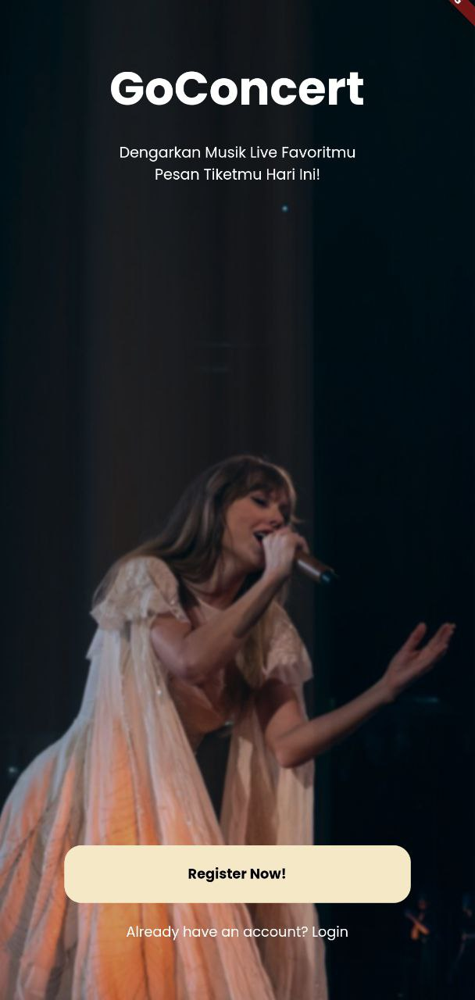</a>

  Halaman start app menjadi tampilan awal ketika pengguna pertama kali membuka aplikasi GoConcert.

* Register Page
  |Sebelum diisi          |Sesudah diisi|Tidak diisi               
  |:-------------------:|:-------------------------------:|:---:
  | 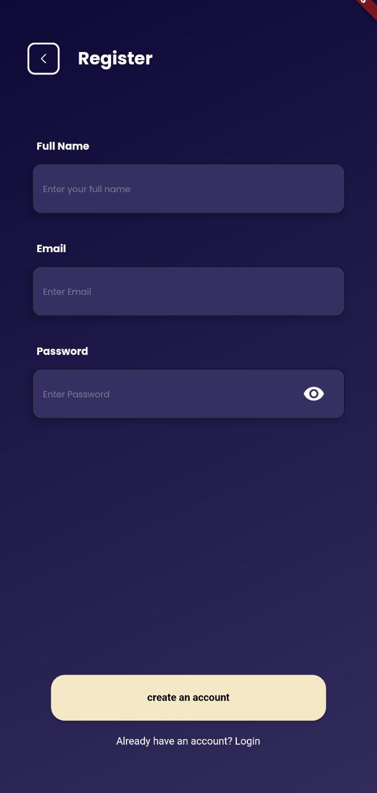</a> | 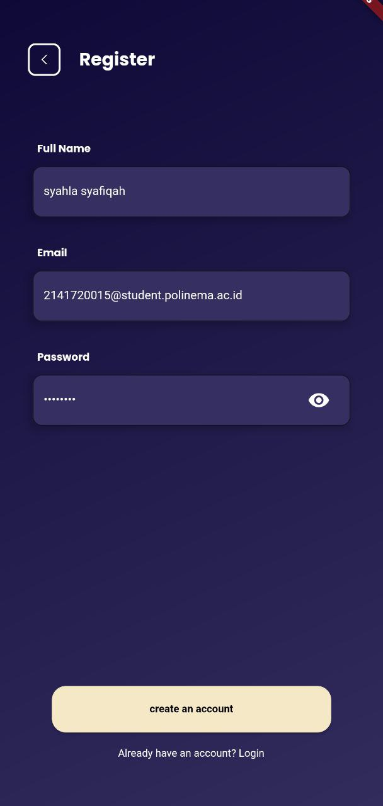</a> | 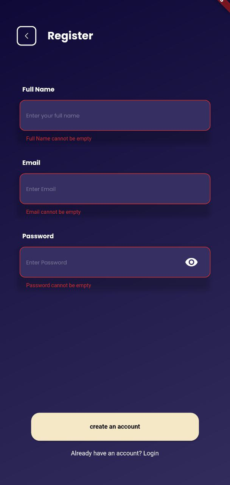</a> |
  
  Halaman register digunakan user untuk melakukan pendaftaran akun dimana pengguna perlu untuk mengisi form seperti nama, email dan kata sandi.

* Login Page
  |Sebelum diisi         |Sesudah diisi               
  |:-------------------:|:-------------------------------:
  | 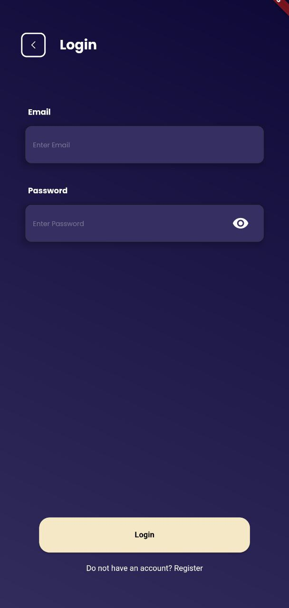</a> | </a> |
  
  Tampilan login digunakan pengguna untuk masuk ke akun dengan memasukkan email dan password yang telah didaftarkan.

* Homepage
  
  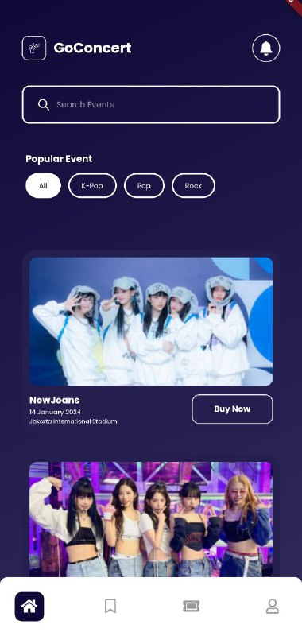</a>

  Halaman home merupakan tampilan pertama kali ketika pengguna berhasil melakukan login. Pada tampilan ini, user dapat melihat konser yang akan diselenggarakan serta juga terdapat notifikasi untuk informasi seperti promo ataupun rekomendasi.

* Homepage (Feature Searching)
  |Sorting by pop         |Sorting by Rock          |Searching|               
  |:-------------------:|:-------------------------------:|:----:|
  | 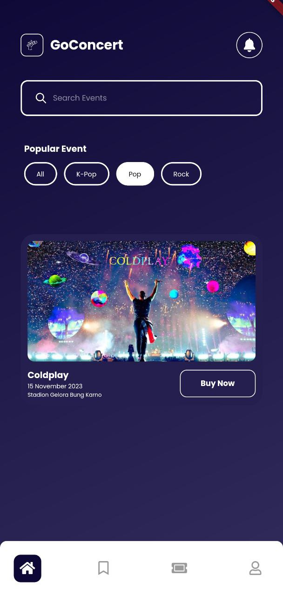</a> | 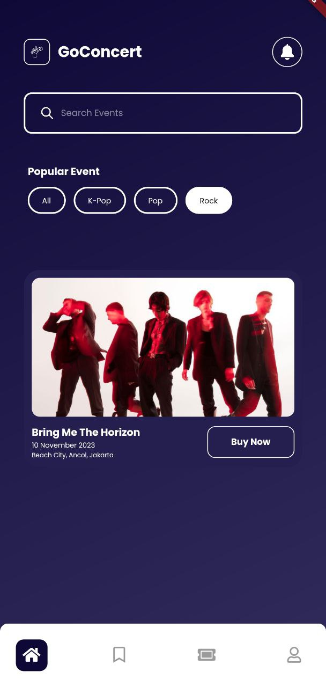</a> | 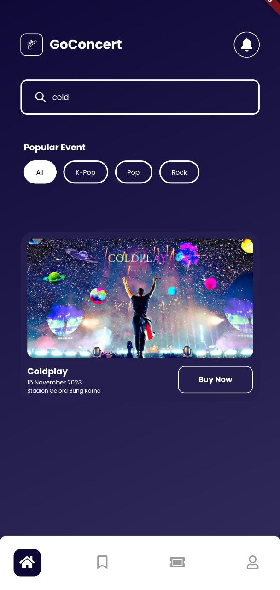</a> |

  Pada Halaman home pengguna dapat melakukan sortir dari popular event dan melakukan pencarian berdasarkan kata kunci yang diinginkan.

* Detail Ticket

  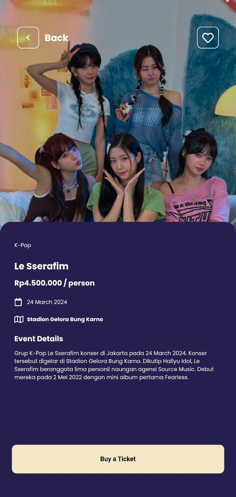</a>

  Pada halaman detail tiket ini, pengguna dapat membaca informasi mengenai konser seperti harga, tanggal, lokasi, dan informasi mengenai konser itu sendiri. Pengguna juga dapat menekan tombol hati yang berguna untuk menambahkannya ke list favorit.

* Scan KTP

  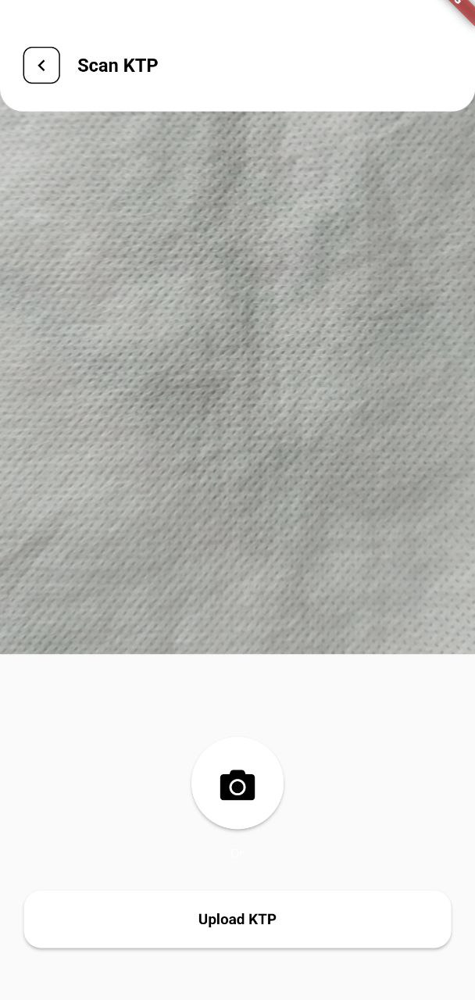</a>

  Halaman scan KTP ini berguna untuk melakukan scan pada KTP dimana hasil scan akan otomatis mengisi pada form data diri yang akan ditampilkan di halaman selanjutnya.

* Self-data Form

  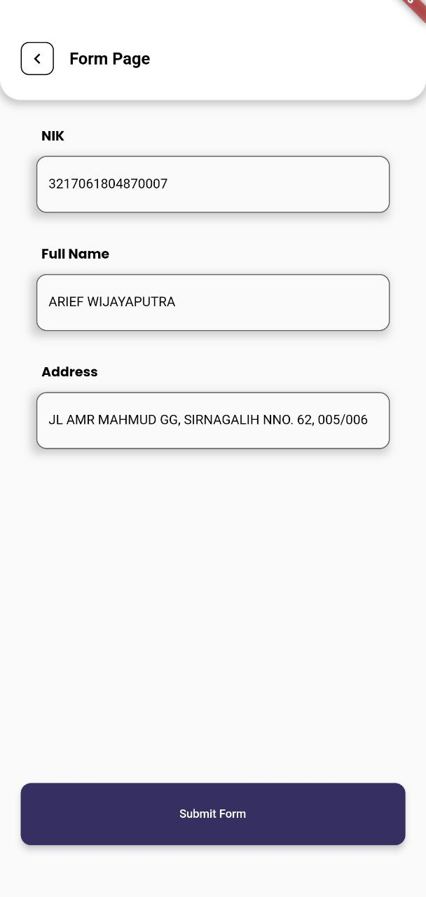</a>

  Halaman form data diri ini merupakan tampilan ketika proses scan KTP berhasil dilakukan sehingga data seperti NIK, nama lengkap, dan alamat akan otomatis terisi.

* Checkout Page

  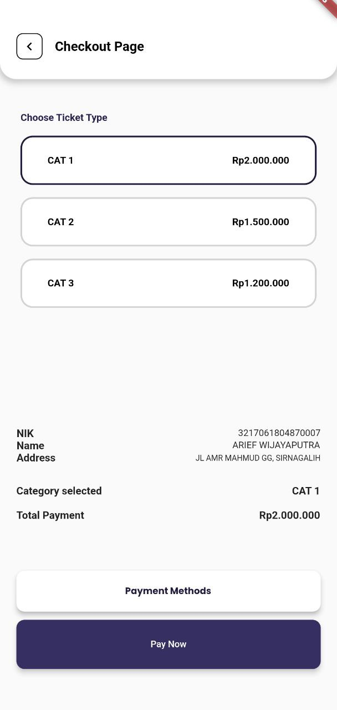</a>

  Pada tampilan checkout, pengguna dapat memilih jenis tiket yang akan dibeli.

* Payment Method

  |Sebelum Memilih        |Sesudah Memilih               
  |:-------------------:|:-------------------------------:
  | 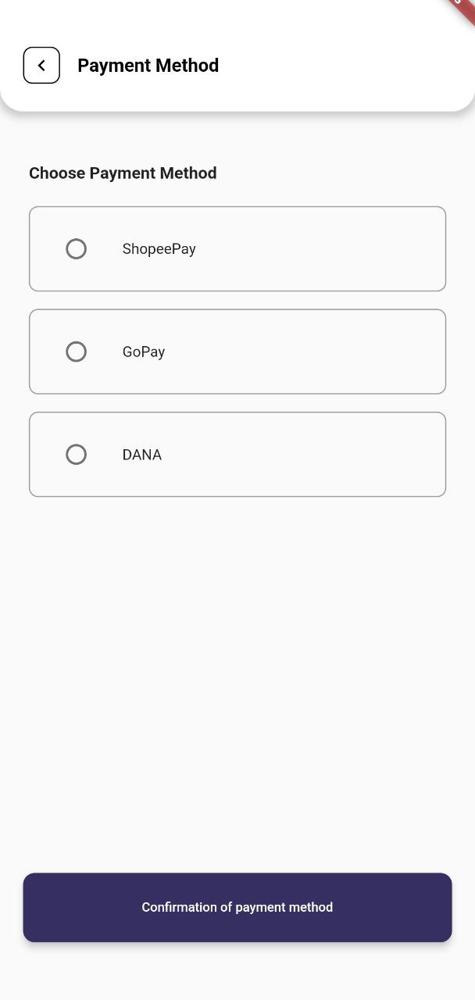</a> | 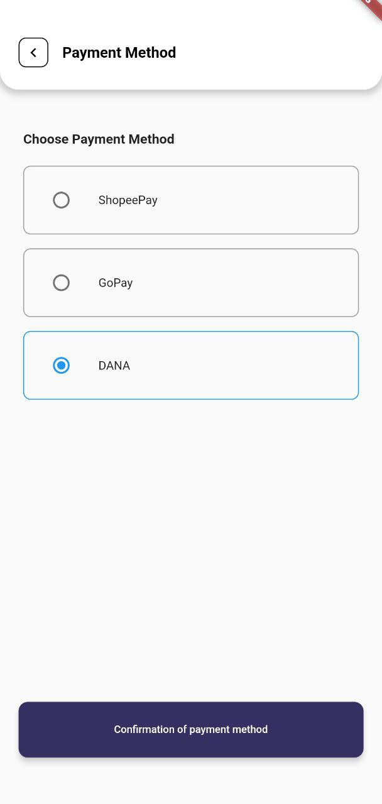</a> |

  Pada halaman metode pembayaran pengguna akan melakukan proses pembayaran pada tiket yang telah dipilih tadi. Pengguna dapat melakukan pembayaran melalui E-Wallet seperti ShopeePay, GoPay maupun DANA.

* Checkout Page (Selected Payment Method)

  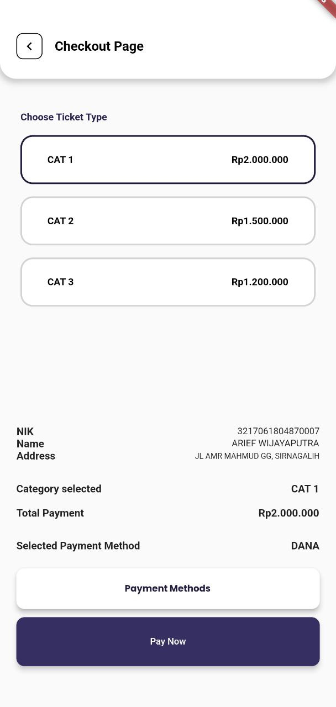</a>

  Setelah Memilih metode pembayaran pengguna akan diarahkan kembali ke halaman checkout.

* Payment Status

  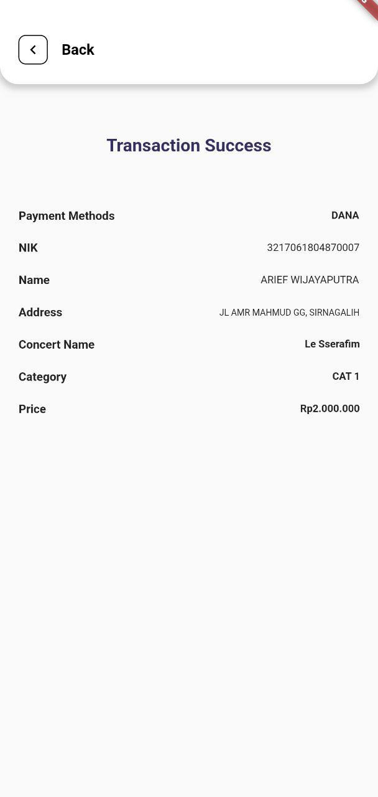</a>

  Pada halaman status pembayaran, ketika pengguna berhasil melakukan proses pembayaran maka akan muncul tampilan seperti di atas. Pengguna akan mendapatkan informasi mengenai tiket yang dibeli.

